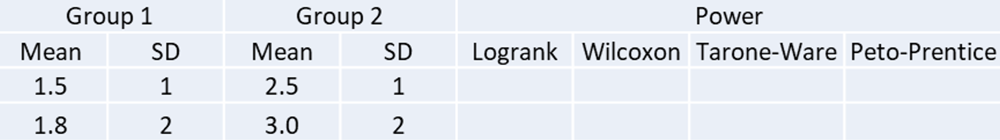

# Problem 1

### a) Construct the 17 2x2 tables for the log-rank test.

|i|Group|Events at $t_{(i)}$|Survival at $t_{(i)}^+$|Expected|At risk at $t_{(i)}^-$|
|---|---|---|---|---|---|
|1|0|0|21|1|21|
|-|1|2|19|1|21|
|-|-|2|40|-|42|
|---|---|---|---|---|---|
|2|0|0|21|1.05|21|
|-|1|2|17|0.95|19|
|-|-|2|38|-|40|
|---|---|---|---|---|---|
|3|0|0|21|0.55|21|
|-|1|1|16|0.45|17|
|-|-|1|37|-|38|
|---|---|---|---|---|---|
|4|0|0|21|1.14|21|
|-|1|2|14|0.86|16|
|-|-|2|35|-|37|
|---|---|---|---|---|---|
|5|0|0|21|1.2|21|
|-|1|2|12|0.8|14|
|-|-|2|33|-|35|
|---|---|---|---|---|---|
|6|0|3|18|1.91|21|
|-|1|0|12|1.09|12|
|-|-|3|30|-|33|
|---|---|---|---|---|---|
|7|0|1|16|0.59|17|
|-|1|0|12|0.41|12|
|-|-|1|28|-|29|
|---|---|---|---|---|---|
|8|0|0|16|2.29|16|
|-|1|4|8|1.71|12|
|-|-|4|24|-|28|
|---|---|---|---|---|---|
|10|0|1|14|0.65|15|
|-|1|0|8|0.35|8|
|-|-|1|22|-|27|
|---|---|---|---|---|---|
|11|0|0|13|1.24|13|
|-|1|2|6|0.76|8|
|-|-|2|19|-|21|
|---|---|---|---|---|---|
|12|0|0|12|1.33|12|
|-|1|2|4|0.67|6|
|-|-|2|16|-|18|
|---|---|---|---|---|---|
|13|0|1|11|0.75|12|
|-|1|0|4|0.25|4|
|-|-|1|15|-|16|
|---|---|---|---|---|---|
|15|0|0|11|0.73|11|
|-|1|1|3|0.27|4|
|-|-|1|14|-|15|
|---|---|---|---|---|---|
|16|0|1|10|0.79|11|
|-|1|0|3|0.21|3|
|-|-|1|13|-|14|
|---|---|---|---|---|---|
|17|0|0|10|0.77|10|
|-|1|1|2|0.23|3|
|-|-|1|12|-|13|
|---|---|---|---|---|---|
|22|0|1|6|1.56|7|
|-|1|1|1|0.44|2|
|-|-|2|7|-|9|
|---|---|---|---|---|---|
|23|0|1|5|1.71|6|
|-|1|1|0|0.29|1|
|-|-|2|5|-|7|
|---|---|---|---|---|---|


### b) Verify the rank statistics by calculating the difference of the observed and expected in each 2x2 tables

```{r}
d0_e0<-c(0-1,0-1.05,0-0.55,0-1.14,0-1.2,3-1.91,1-0.59,
         0-2.29,1-0.65,0-1.24,0-1.33,1-0.75,0-0.73,1-0.79,0-0.77,1-1.56,1-1.71)


```

The series is `r d0_e0`. The sum of each difference of the observed and expected is `r sum(d0_e0)`. The calculation result differs slightly from the actual result due to the retention of decimals.

The result is same as the following rank statistics:

$$L= \sum_{i=1}^k(d_{0i}-e_{0i})=-10.25$$


### c) Include the variance calculation for each of the 2x2 tables as well and verify that

$$var(L) = \sum_{i=1}^k \frac{n_{0i}n_{1i}d_i(n_i-d_i)}{n_i^2(n_i-1)}=6.26$$

```{r}
n0 <- c(21,21,21,21,21,21,17,16,15,13,12,12,11,11,10,7,6)
n1 <- c(21,19,17,16,14,12,12,12,8,8,6,4,4,3,3,2,1) 
n <- c(42,40,38,37,35,33,29,28,23,21,18,16,15,14,13,9,7)
d <- c(2,2,1,2,2,3,1,4,1,2,2,1,1,1,1,2,2)

L=sum(n0*n1*d*(n-d)/(n^2*(n-1)))
L
```


# Problem 2

#### Step 1: Prepare a table shell or figure shell to compare the simulation results 

For example:



#### Step 2: Choose parameters – parameters may need to be adjusted to obtain adequate power for comparisons

* Sample size n1 and n2 for Groups 1 and 2, respectively; 
* Create two survival datasets, given that both of the failure times are log-normally distributed, with equal variance but different means.
* Choose maximum follow-up time
* Choose simulation trials, for power trials=2000

#### Step 3: For each trial 

* Generate data for two independent groups based on normal distributions, with sample size n1 and n2 for Groups 1 and 2, respectively
* Transform normally distributed data to log-normal
* Generate independent random censoring data using exponential distribution
* Obtain observed survival data
* Test between group difference in survival time and obtain the p-values for log-rank, Wilcoxon, Tarone-Ware, and Peto-Prentice

#### Step 4: Repeat Step 3 for 2000 times

#### Step 5: Calculate the proportion of p-values that are significant at the level of 2-sided 0.05 (or 1-sided 0.025). Especially compare the powers of Wilcoxon test with other tests, to see whether the Wilcoxon test has the optimal power or not.

# Problem 3


#### Please discuss how to perform the analysis: stratified or non-stratified analyses? How would you recommend the analysis?

The choice of analysis method depends on the design and objectives of the trial.

If the trial was designed to test the effect of the new treatment in the overall population, regardless of the biomarker status, then a non-stratified analysis would be appropriate. This would compare the survival outcomes of the new treatment group and the SOC group without adjusting for the biomarker variable. However, this analysis might not detect a significant difference between the groups, since the positive effect of the new treatment in the biomarker+ subgroup would be offset by the negative effect in the biomarker- subgroup. Moreover, this analysis would not provide any information on how the new treatment interacts with the biomarker variable, which might be clinically relevant.

If the trial was designed to test the effect of the new treatment in different subgroups defined by the biomarker status, then a stratified analysis would be appropriate. This would compare the survival outcomes of the new treatment group and the SOC group within each biomarker subgroup, adjusting for the stratification variable. This analysis would allow for a more precise estimation of the treatment effect in each subgroup, and also enable testing for a potential interaction between the treatment and the biomarker variable. However, this analysis might require a larger sample size to achieve adequate power in each subgroup, and it might also increase the risk of type I error due to multiple comparisons.

Therefore, the choice of analysis method should be based on the primary research question and hypothesis of the trial, and ideally pre-specified in the protocol or statistical analysis plan.

#### Do you think if FDA should approve this drug?

This is a very difficult question to answer, as there are many factors that the FDA would consider before approving a new drug. Some of these factors are:

The magnitude and significance of the treatment effect in the biomarker+ subgroup. How much does the new treatment improve the survival outcomes compared to the SOC? Is this difference statistically and clinically meaningful?
The safety and tolerability of the new treatment in both subgroups. How severe and frequent are the adverse events associated with the new treatment? How do they compare to the SOC? Are there any serious or unexpected risks that outweigh the benefits?
The validity and reliability of the biomarker test. How accurate and precise is the test in identifying the biomarker+ and biomarker- subgroups? How easy and feasible is it to perform the test in clinical practice? How well is the test validated and standardized across different settings and populations?
The ethical and social implications of approving a drug that harms a subgroup of patients. How can the FDA ensure that only the biomarker+ patients receive the new treatment and not the biomarker- patients? How can the FDA communicate this information to the public and health care providers? How can the FDA address any potential issues of discrimination, stigma, or access that might arise from approving such a drug?
Therefore, the FDA would need to weigh all these factors carefully and balance the benefits and risks of the new treatment for both subgroups. The FDA would also need to review the quality and rigor of the trial design, conduct, analysis, and reporting, as well as any other relevant data from preclinical or clinical studies. The FDA might also seek input from external experts, stakeholders, or patients through advisory committees, public hearings, or patient-focused drug development meetings.

Ultimately, the FDA’s decision would depend on whether the new treatment provides a substantial improvement over existing therapies for a serious or life-threatening condition, and whether there is sufficient evidence to support its safety and effectiveness in the intended population.


